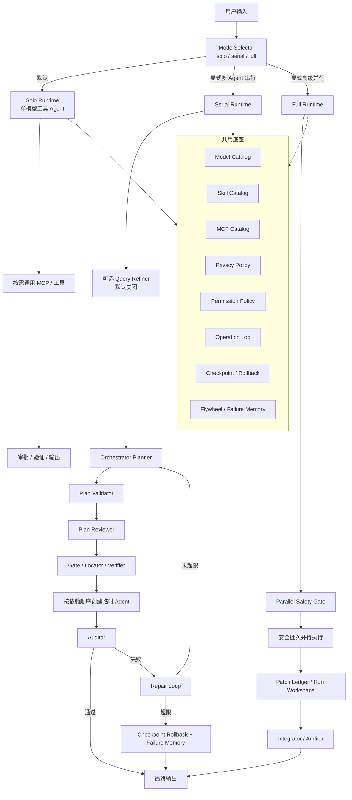

# agents_demo 新修改方向

本文档基于 2026-05-08 对当前项目文件的重新扫描整理，目的是把项目从“单一动态多智能体编排”调整为“多种执行模式共用同一套安全底座”的架构。

核心结论：

1. 不建议把“并行多 Agent 写代码”作为默认主线。
2. 应把系统拆成三种核心执行模式：单模型工具 Agent、多 Agent 串行、高级并行多 Agent。
3. 不再保留 `auto/default` 自动路由模式，默认就是 `solo`，避免系统替用户猜测任务该走哪条链路。
4. `solo` 不是轻量聊天模式，而是类似 Claude CLI 的单模型工具 Agent：可以读文件、写文件、跑命令、联网和验证，但不创建多 Agent、不调用主脑、不调用前置副脑和汇总副脑。
5. 三种模式不应拆成三套项目，而是共用同一套模型图书馆、Skill 图书馆、MCP 图书馆、权限策略、隐私策略、日志、checkpoint 和测试体系。

---

## 一、当前项目事实核实

### 1.1 当前项目目录

当前项目主要目录如下：

| 目录 | 当前作用 |
| --- | --- |
| `main.py` | CLI 入口、对话循环、`/plan`、`/config`、`/model`、`/privacy`、`/api show`、`/stop`、`/new`、`/exit` |
| `planning/` | 主脑规划、规划 schema、计划校验、计划审查 |
| `runtime/` | 动态执行、Agent 工厂、Gate、Verifier、Auditor、checkpoint、repair loop、Flywheel、CLI 配置展示 |
| `mcp_servers/` | 文件只读、代码定位、文件编辑、命令执行、Git、联网搜索、安全删除等 MCP |
| `catalog_system/` | Skill/MCP/Model 图书馆刷新、模型探测、权限策略 |
| `skills/` | 主脑、前置优化、汇总、项目分析、代码、中文润色、Skill 创建等技能 |
| `catalogs/` | 自动生成的 Skill/MCP/Model/Permission 图书馆 |
| `tests/` | 单文件回归测试，目前覆盖工具、规划、模型、隐私、运行时、checkpoint、Flywheel 等 |

### 1.2 已经实现的关键能力

| 能力 | 当前状态 | 说明 |
| --- | --- | --- |
| 动态模型图书馆 | 已实现 | 可从 `.env` 动态发现模型，支持共享 API key + 多模型版本 |
| 前置优化副脑 | 已实现，默认关闭 | `AGENTS_QUERY_REFINER_ENABLED=true` 时可开启 |
| 主脑规划 | 已实现 | `orchestrator_planner_agent` 输出结构化计划 |
| 弱模型 JSON fallback | 已实现 | 本地/弱模型不返回 JSON 时会进入保守兜底 |
| direct answer 路线 | 已实现 | 当前仍属于主脑规划后的直接回答分支；后续应被真正独立的 `solo runtime` 取代 |
| 多 Agent 动态创建 | 已实现 | `AgentFactory` 根据任务动态装配模型、Skill、MCP |
| Plan Reviewer | 已实现 | 执行前审查计划依赖、冲突和不完整风险 |
| Plan Validator | 已实现 | 检查模型、MCP、隐私策略、汇总要求等 |
| Gate / Locator / Verifier | 已实现基础版 | 代码任务会补定位、只读上下文、编辑工具和验证摘要 |
| BM25 + AST Locator | 已实现 Python MVP | `code_locator_mcp.py` 支持索引、符号、调用图缓存 |
| 半串行调度 | 已实现基础版 | 根据 `parallel_group`、`depends_on`、`write_intent` 分批执行 |
| Auditor | 已实现 | 执行后对任务状态、验收标记、验证结果做检查 |
| Repair Loop | 已实现 | 最多 3 轮，失败后进入回滚和失败记忆 |
| Checkpoint / Rollback | 已实现基础版 | clean git 工作区可回滚，dirty 工作区有保护和 scoped rollback |
| Flywheel / Failure Memory | 已实现雏形 | 记录流水线摘要和失败案例 |
| MCP 懒加载 | 已实现 | 按任务需要启动 MCP，不再一次性启动所有 MCP |
| 操作审批 | 已实现 | 写文件、删文件、命令、git commit 等高风险工具需要审批 |
| Token 统计 | 已实现 | 每轮按 Agent 输出请求、输入、输出、reasoning、总 token |

### 1.3 当前仍需补强的真实短板

以下不是概念问题，而是对当前代码核实后的实际边界：

| 问题 | 当前事实 | 建议优先级 |
| --- | --- | --- |
| 单模型工具 Agent 模式缺失 | 现在普通问题和工程任务仍容易先进入主脑规划，缺少类似 Claude CLI 的单模型直接执行链路 | 高 |
| 执行模式没有显式 profile | 目前只有动态编排入口，没有 `solo / serial / full` 明确模式层 | 高 |
| `workspace_edit` 的 sha256 已服务端强制 | strict 模式默认开启，覆盖、替换、删除已有文件或 apply patch 时未传 `expected_sha256` 会拒绝执行 | 已完成 |
| 并行写冲突检测仍偏弱 | 已看 `write_intent`，但路径包含关系、未知写集、目录级冲突还需增强 | 高 |
| offline 联网策略已可配置 | 默认保持 `warn`，符合“提示风险后由用户审批”的产品取舍；如需真断网可设 `AGENTS_OFFLINE_NETWORK_MCP_POLICY=block` | 已完成 |
| fast path 已纳入统一审计 | URL-only web_search 和 git status 直调路径会写入统一 operations.jsonl | 已完成 |
| 终端体验仍是 print 文本 | 没有流式输出、diff 预览、折叠、会话持久化 | 中 |
| 配置命令只读 | `/model`、`/privacy`、`/api` 当前只提示，不改写配置 | 中 |
| 文档和测试仍集中 | 测试集中在 `tests/run_regression.py`，长期会变重 | 中 |

---

## 二、新目标定位

项目不应只定位成“多 Agent 编排器”，而应定位为：

```text
一个支持单模型、串行多 Agent、高级并行多 Agent的本地终端工程代理。
```

它的核心价值不是“Agent 越多越强”，而是：

1. 默认使用一个模型直接完成任务，形成类似 Claude CLI 的单 Agent 工程体验。
2. 用户明确启用多 Agent 时，再进入串行或高级并行编排。
3. 工程任务始终要可审查、可验证、可回滚。
4. 并行能力只在安全边界明确时开启。
5. 本地模型、云端模型、联网工具都受统一隐私和权限策略控制。

---

## 三、三种产品入口

| 模式 | 面向用户名称 | 实际含义 | 默认推荐 |
| --- | --- | --- | --- |
| `solo` | 单模型工具 Agent 模式 | 一个模型直接处理问题，可调用工具/MCP，可读写文件、跑测试、联网和验证，但不创建多 Agent | 默认 |
| `serial` | 多 Agent 串行模式 | 主脑规划，多专家按顺序处理，Auditor 验收 | 显式多 Agent / 复杂分工 |
| `full` | 高级并行多 Agent 模式 | 满足安全门槛时允许部分任务并行 | 实验/高级 |

注意：不再提供 `auto` 自动选择入口。模式由用户或配置显式决定，系统不根据关键词偷偷切换执行链路。

---

## 四、模式一：单模型 Agent 模式

### 4.1 目标

把默认体验改成一个强单模型 Agent 直接完成任务。它既能聊天，也能处理项目、调用工具、修改文件、运行测试和联网检索，但始终保持单 Agent，不进入主脑规划和多 Agent 编排。

### 4.2 适用场景

- 闲聊、能力介绍、概念解释
- 项目分析、代码定位、代码修改、测试运行
- 联网检索、git 查询、文件读写
- 用户希望像 Claude CLI 一样由一个模型直接完成的任务
- 用户没有明确要求创建多个 Agent 的所有任务

### 4.3 建议执行链路

```text
用户输入
  -> solo_agent
  -> 按需调用 MCP / 工具
  -> 写入审批 / 删除审批 / 命令审批
  -> 验证与输出报告
```

能力边界：

- 可以调用 MCP、读写文件、运行命令、联网、检查 git、运行测试。
- 不能创建多个 Agent。
- 不能调用 `query_refiner_agent`、`orchestrator_planner_agent`、`final_synthesizer_agent`。
- 不能自动升级到 `serial` 或 `full`。
- 如果用户在 `solo` 下明确要求“创建多个 Agent / 多 Agent 并行 / 多专家分工”，系统只说明当前模式边界：当前是 solo 单 Agent 模式，若要多 Agent 需要用户显式切换到 `serial` 或 `full`。

### 4.4 与当前项目的关系

当前项目已经有 `direct_answer_agent`，但它是在主脑规划之后才执行。  
新方向不是做一个更弱的聊天入口，而是新增真正独立的 `solo runtime`：它绕过主脑规划，直接创建一个单模型工具 Agent 完成任务。

### 4.5 验收标准

- 默认模式为 `solo`。
- 输入“你好你有什么技能”时，不进入 `query_refiner_agent`，不进入 `orchestrator_planner_agent`，不创建多 Agent。
- 输入“分析当前项目并修改问题”时，也由单 Agent 直接处理，不自动建议切换模式。
- 需要读写、删除、运行命令时，仍必须经过统一权限审批、备份、checkpoint、日志和隐私策略。
- 用户明确要求多 Agent 时，solo 不偷偷执行多 Agent，只提示模式边界。

---

## 五、模式二：多 Agent 串行模式

### 5.1 目标

这是显式多 Agent 工程模式，不再作为默认入口。

它强调：

- 任务拆分合理
- 顺序明确
- 每一步基于最新项目状态
- 执行后有验证
- 失败后可修复
- 修复失败可回滚

### 5.2 适用场景

- 分析项目结构
- 定位 bug
- 修改代码
- 创建 Skill
- 先分析再改造
- 需要运行测试或检查 git diff
- 用户要求“分步骤完成”
- 用户明确要求“多 Agent / 多专家 / 主脑分配 / 串行多智能体”

### 5.3 建议执行链路

```text
用户输入
  -> 可选 Query Refiner（默认关闭）
  -> Orchestrator Planner
  -> Plan Validator
  -> Plan Reviewer
  -> Gate / Locator / Verifier 策略加固
  -> 按任务依赖顺序逐个创建 Agent
  -> 每个 Agent 使用最新项目状态执行
  -> Auditor 验收
  -> 不通过则 Repair Loop
  -> 达到上限则 Rollback + Failure Memory
  -> 输出最终报告
```

### 5.4 当前已经具备的基础

| 子能力 | 当前状态 |
| --- | --- |
| Planner | 已有 |
| Validator | 已有 |
| Reviewer | 已有 |
| Gate | 已有 |
| Locator | 已有 |
| Verifier | 已有只读 git 状态/diff 摘要 |
| Auditor | 已有 |
| Repair Loop | 已有 |
| Checkpoint | 已有 |
| Failure Memory | 已有雏形 |

### 5.5 需要继续强化

1. 将 `serial` 作为显式 profile，而不是隐藏在 `multi_agent` 分批里。
2. 每个任务执行前重新获取必要上下文，避免后序 Agent 基于旧文件状态工作。
3. 对写入任务强制声明 `write_intent`。
4. 对写入工具强制 sha256 或 patch 基线。
5. Auditor 要从“结构化验收”逐渐升级到“语义验收 + diff 验收”。

### 5.6 验收标准

- 用户显式选择 `serial` 时，多步骤项目任务按主脑计划串行执行。
- 同一文件多任务修改必须串行。
- 后续任务能看到前序任务输出。
- 修改类任务必须有验证摘要。
- 失败 3 轮后项目能恢复到执行前安全状态或说明不能回滚的原因。

---

## 六、模式三：高级并行多 Agent 模式

### 6.1 目标

保留并行能力，但把它定义为高级模式，而不是默认路径。

并行不是为了炫技，而是为了在明确安全边界下提升速度：

- 多个只读分析任务可以并行。
- 明确不同目录/文件的任务可以半并行。
- 写同一文件或未知写入范围的任务必须降级串行。

### 6.2 适用场景

- 大型项目的多模块只读分析
- 前端/后端/文档互不冲突的任务
- 多个独立文件的低风险修改
- 用户明确允许高级并行
- 工作区处于可 checkpoint 的安全状态

### 6.3 禁止或降级场景

以下情况必须从 `full` 降级到 `serial`：

- 任意任务缺少 `write_intent`
- 多个任务写同一个文件
- 一个任务写目录，另一个任务写该目录下文件
- 任务之间有 `depends_on`
- 当前 git 工作区脏且无法 scoped rollback
- 任意任务需要删除目录或大范围重写
- 当前模型不支持工具调用或不适合执行

### 6.4 建议执行链路

```text
用户输入
  -> Planner 输出任务 DAG
  -> Plan Reviewer 审查并行合理性
  -> Parallel Safety Gate
  -> 构造安全批次
  -> 同批只执行无冲突任务
  -> Patch Ledger 记录每个任务产出
  -> Integrator / Auditor 收口
  -> Verifier 统一验证
  -> 失败则按批次定位，必要时回滚
```

### 6.5 当前项目已有基础

当前 `runtime/dynamic_runtime.py` 已经有：

- `parallel_group`
- `depends_on`
- `_execution_batches_for_group`
- `write_intent`
- `PatchProposalLedger`
- `RunWorkspace`
- `final_synthesizer_agent`

但当前不应视为完整并行安全系统，因为：

- 路径冲突主要是字符串相等，不足以覆盖目录包含关系。
- `write_intent` 依赖主脑声明，弱模型可能漏写。
- `workspace_edit` 已从服务端默认强制 sha256，避免基于旧文件状态覆盖修改。
- 没有 worktree 隔离。
- 并行失败后的精确回滚粒度仍需增强。

### 6.6 验收标准

- 只读任务可以并行。
- 不同文件的写入任务可以并行或半并行。
- 同路径、父子路径、未知写集一律串行。
- 并行批次失败后能明确指出失败任务和影响范围。
- 默认不启用 full，必须由配置或命令显式打开。

---

## 七、模式边界与禁止自动升级

### 7.1 核心原则

系统不再根据关键词自动选择模式。用户当前处于什么模式，就使用什么模式完成任务。

```text
solo   -> 一个模型带工具完成任务
serial -> 主脑拆分，多 Agent 串行完成任务
full   -> 主脑拆分，通过安全门后允许高级并行
```

### 7.2 Solo 的边界

`solo` 可以完成所有单 Agent 能完成的任务，包括工程任务。它不应因为任务复杂就劝用户切换模式，也不应偷偷升级到 `serial`。

唯一需要提示模式边界的情况是：用户明确要求系统创建多个 Agent、多个专家、主脑分配任务或并行多 Agent。此时系统只说明：

```text
当前是 solo 单 Agent 模式，不能创建多个 Agent。
如果你要多 Agent，请显式切换到 serial 或 full。
```

### 7.3 Serial / Full 的边界

`serial` 和 `full` 都是显式多 Agent 模式。它们可以调用主脑、计划审查、任务拆分、Auditor 和 Repair Loop。  
`full` 比 `serial` 多一层并行安全门，但不允许绕过冲突检测。

---

## 八、共用底座

无论使用哪种模式，以下能力必须共用，不能重复实现。

### 8.1 模型底座

- `catalog_system/model_catalog.py`
- `catalog_system/model_probe.py`
- `runtime/settings.py`
- `runtime/privacy.py`

原则：

- 模型只在模型图书馆注册一次。
- `solo / serial / full` 都从同一个 `ModelRegistry` 取模型。
- 本地优先、offline、cloud_allowed 的策略必须统一。
- 不允许某个模式绕过隐私策略。

### 8.2 Skill 底座

- `skills/`
- `skills/loader.py`
- `skills/registry.py`
- `catalogs/skill_catalog.json`

原则：

- Skill 是“专家能力说明”，不是模式本身。
- 单模型模式可以使用一个通用工程 Agent Skill，但不动态创建多个专家 Skill Agent。
- 串行/并行模式按任务动态选择 Skill。

### 8.3 MCP 底座

- `mcp_servers/`
- `MCPServerManager`
- `catalogs/mcp_catalog.json`

原则：

- MCP 必须懒加载。
- 高风险 MCP 必须审批。
- 写入、删除、命令、commit 不允许绕过审批。
- fast path 也必须纳入统一日志和隐私校验。

### 8.4 安全底座

必须共用：

- 权限策略
- 隐私策略
- 操作日志
- checkpoint
- backup
- rollback
- failure memory
- token 统计

任何模式都不能因为“单 Agent”或“默认模式”而绕过安全层。

---

## 九、对旧路线图的调整

### 9.1 保留

继续保留以下方向：

- A 阶段安全工具层
- A+ 本地优先模型和隐私模式
- B 阶段 Gate / Locator / Verifier / Flywheel
- N1-N4 的计划审查、Auditor、checkpoint、repair loop、任务 schema
- C 阶段终端代理产品化

### 9.2 调整

| 原方向 | 新调整 |
| --- | --- |
| 默认动态多 Agent | 改为 `solo` 单模型工具 Agent |
| 汇总副脑作为最终核心 | 改为 Auditor 核心，Synthesizer 只在多任务汇总时使用 |
| 多 Agent 并行作为高级能力 | 降级为 `full` 实验/高级模式 |
| query refiner 默认开启 | 已改为默认关闭，后续 CLI 命令控制 |
| 所有任务先主脑规划 | 默认不走主脑规划，只有 `serial/full` 才调用主脑 |

### 9.3 暂缓

以下不作为近期第一目标：

- CRDT 协同编辑
- Agent 间自由对话总线
- 大规模并行写代码
- TUI 全屏界面
- llama.cpp 原生推理完整接入
- 知识图谱长期记忆

---

## 十、建议的后续阶段计划

### D1：执行模式 profile 层

目标：把 `solo / serial / full` 变成明确配置和运行时概念，并移除 `auto/default` 自动路由。

| 任务 | 验收标准 |
| --- | --- |
| [x] 新增 `AGENTS_EXECUTION_MODE=solo/serial/full` | 启动日志显示当前执行模式，未配置时默认 `solo` |
| [x] 新增 `ExecutionMode` 配置对象 | runtime 不再用散落判断表示模式 |
| [x] 移除 `auto` 路由 | 系统不再根据关键词猜测模式，旧 `auto` 会兼容归一为 `solo` |
| [x] `/mode` 只读查看 | 用户能看到当前模式和可选模式 |

### D2：Solo 模式

目标：让默认单模型工程 Agent 独立可用，接近 Claude CLI 的单 Agent 体验。

| 任务 | 验收标准 |
| --- | --- |
| [x] 新增 solo agent runner | 所有 `solo` 输入都不调用 orchestrator planner |
| [x] solo 可挂工具/MCP | 可读文件、写文件、联网、跑命令、运行测试，并按意图懒加载 MCP；只读文件 MCP 使用 solo 专属硬预算 |
| [x] solo 安全底座 | 写入、删除、命令、commit 仍需审批和日志 |
| [x] 禁止自动升级 | 复杂任务不自动切 `serial`，明确多 Agent 请求只提示模式边界 |
| [x] 回归测试 | solo 无 `query_refiner_agent`、无 `orchestrator_planner_agent`、无多 Agent 创建 |

### D3：Serial 模式固定为显式多 Agent 工程模式

目标：把当前动态模式整理成可维护的串行工程模式。

| 任务 | 验收标准 |
| --- | --- |
| [x] 将当前 `execute_dynamic_request` 梳理为 serial runtime | `serial` 下多 Agent 批次显式串行，`full` 才保留安全并行 |
| [x] 多任务默认按依赖顺序执行 | 不再让主脑随意并行写项目 |
| [x] 每步执行前补最新上下文 | 每个任务执行前都会注入最新 git 工作区状态、声明读取范围和写入范围 |
| [x] Auditor 语义增强 | 已加入规则式语义验收：从验收标准中提取具体模块名、文件路径、关键对象，避免只做机械全文匹配 |

### D4：并行安全门

目标：让 full 模式只在安全时并行。

| 任务 | 验收标准 |
| --- | --- |
| [x] 路径包含关系冲突检测 | `src/` 与 `src/a.py` 判定冲突 |
| [x] 未知写集串行化 | 没有 `write_intent` 的写任务不能并行 |
| [x] full 模式显式开启 | 默认 `solo` 不进入多 Agent，`serial` 不主动进入写入并行，只有 `full` 保留安全批次并行 |
| [x] 并行批次审计报告 | 用户能看到哪些任务并行、为什么安全 |
| [x] `code_locator` 缓存隔离与原子写入 | 回归测试使用独立缓存目录，索引写入使用临时文件原子替换 |
| [x] 只读分析预算收束 | 大文件分析提示先定位/分段，预算不足时明确说明部分分析；solo 模式已在 MCP 环境变量层强制更小读取预算 |

### D4+：目录拆分与图书馆清理

目标：把运行时和 MCP 目录按职责拆开，减少根目录堆叠，同时保持原有图书馆自动刷新能力。

| 任务 | 验收标准 |
| --- | --- |
| [x] runtime 模式拆分 | `runtime/modes/solo.py`、`runtime/modes/serial.py`、`runtime/modes/full.py` 分别承载三种模式入口 |
| [x] 对话上下文拆分 | `runtime/common/conversation.py` 独立处理短期上下文 |
| [x] runtime 职责目录拆分 | `agents/`、`config/`、`execution/`、`safety/`、`memory/`、`workspace/`、`modes/`、`common/` 按职责放置实现，根目录不再堆放运行时模块 |
| [x] runtime 目录说明 | `runtime/README.md` 说明每个目录用途和 solo 读取预算 |
| [x] MCP 目录按类别拆分 | `readonly/`、`mutation/`、`execution/`、`network/`、`core/` 分别放只读、变更、执行、联网和公共模块 |
| [x] MCP 图书馆递归扫描 | 新增子目录 MCP 仍能被发现为待登记项 |
| [x] 已实现 MCP 不误报待登记 | `budgeted_filesystem`、`command`、`git`、`safe_delete` 等实现文件不会重复出现在待登记列表 |

### D5：硬安全补强

目标：把 prompt 约束变成代码约束。

| 任务 | 验收标准 |
| --- | --- |
| [x] `workspace_edit` 强制 sha256 配置 | strict 模式默认开启，已有文件未传 sha256 直接拒绝 |
| [x] zip 备份大小上限 | 写入备份与安全删除备份都会先检查字节数和文件数上限，避免大目录压缩失控 |
| [x] offline 联网策略可配置 | 默认保留 `warn`，用户可设置 `AGENTS_OFFLINE_NETWORK_MCP_POLICY=block` 实现严格断网 |
| [x] fast path 纳入统一审计 | web_search/git status 直调也记录到统一 operations.jsonl |

### D6：C 阶段终端代理体验

目标：向 Claude Code / opencode 的体验靠近。

| 任务 | 验收标准 |
| --- | --- |
| [x] `/status` | 查看当前模式、模型可用数量、已启动 MCP、git 状态和最近一轮回滚点 |
| [x] `/diff` | 查看当前 git diff 文件、统计和截断预览 |
| [x] `/rollback` | 用户主动回滚最近一轮由 Agent 产生的改动；没有可回滚点时明确提示 |
| [x] `/mode` 写配置 | 可切换 solo/serial/full，并立即更新当前会话与 `.env` |
| [x] `/refiner on/off` | 控制前置优化副脑，并立即更新当前会话与 `.env` |
| [x] 流式输出 | 默认输出模型可见文本增量；可用 `AGENTS_STREAM_OUTPUT=0` 关闭，不输出隐藏思考链 |
| [x] diff 预览 | `/diff` 提供截断 diff 预览；写入/删除/命令审批前增加短预览，说明目标和影响范围 |

D6 实施备注：

- 已按 TDD 增加 CLI 配置写入、状态/diff、会话 checkpoint、流式增量过滤和写入审批预览测试。
- 当前真实 CLI 已验证 `/status`、`/diff`、`/mode solo|serial`、`/refiner on|off`、`/model available`、`/rollback`、`/exit` 可运行。
- 启动慢的主要线索不是 Skill/MCP 扫描，而是 `catalog_system.model_catalog` 导入链和启动模型探测；后续应单独做 D6+ 启动性能优化。

---

## 十一、关键设计取舍

### 11.1 为什么不默认并行

因为并行写代码的根本问题不是“Agent 沟通不够”，而是共享工作区一致性：

- Agent A 改完后，Agent B 的上下文可能过期。
- 两个 Agent 可能改同一文件。
- 一个 Agent 可能改目录级结构，影响另一个 Agent 的文件假设。
- 验证和回滚的基线会漂移。
- 失败后很难判断哪一个 Agent 污染了项目。

所以默认策略应该是：

```text
先串行稳定完成，再谨慎恢复局部并行。
```

### 11.2 为什么仍保留 full 模式

因为 full 模式在以下场景有价值：

- 只读多模块分析
- 大项目并行梳理
- 明确无冲突的独立文件任务
- 后续 worktree 隔离成熟后

它应该是高级能力，不是普通默认。

### 11.3 为什么保留 query refiner 但默认关闭

query refiner 对复杂需求有帮助，但普通用户多数问题不需要它。  
默认关闭可以降低 token 和延迟。  
后续通过 `/refiner on` 或配置打开即可。

### 11.4 为什么要把 Auditor 放在核心

汇总副脑只负责“把多个输出写成一段话”。  
Auditor 负责判断“是否真的完成用户目标”。  
工程代理真正需要的是后者。

---

## 十二、建议的新架构图



---

## 十三、短期最推荐执行顺序

最稳的下一步不是继续加大并行，而是：

1. 增加执行模式配置：`solo / serial / full`
2. 实现 solo 单模型工具 Agent，让默认任务跳过主脑规划但保留工具能力和安全底座
3. 将当前动态执行整理命名为 serial runtime
4. 给 full 模式加显式开关和并行安全门
5. 补 `workspace_edit` 服务端 strict sha256
6. 补路径包含关系冲突检测
7. 再进入 `/mode`、`/status`、`/diff`、`/rollback` 等 C 阶段 CLI

---

## 十四、最终结论

新的修改方向可以概括为一句话：

```text
把 agents_demo 从“默认复杂多 Agent 编排”升级为“默认单模型工具 Agent，显式多 Agent 编排”的终端工程代理。
```

具体是：

- 默认入口：`solo`
- 普通问题和大多数单 Agent 工程任务：走 `solo`
- 用户明确要求多 Agent 串行分工：走 `serial`
- 用户明确要求高级并行且安全门通过：走 `full`

这样既保留当前项目已经完成的多模型、多 Skill、多 MCP、安全回滚和审计能力，又让默认体验更接近 Claude CLI：一个模型直接干活。多 Agent 编排只在用户明确选择时启用，避免系统替用户猜测模式，也避免过早把并行写代码作为默认能力带来竞态风险。
